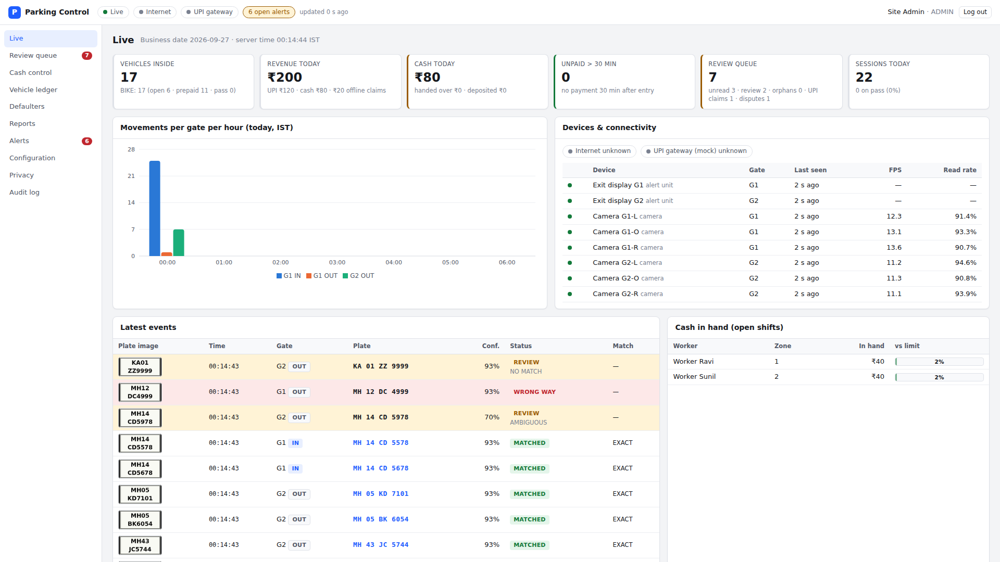

# Admin / supervisor dashboard

React 18 + TypeScript + Vite single-page app for the edge server. The backend serves the built files from `dashboard/dist`
(`/assets/*` plus an SPA fallback for every other path; see `backend/app/main.py`, setting `PARK_DASHBOARD_DIST`).

Two roles use it:

- **ADMIN** can use every page, including Configuration edits, Privacy and the Audit log.
- **SUPERVISOR** can use all the operations pages. Configuration is read-only for supervisors, except for zone assignments.

Workers and guards are turned away at login, because they use the phone app.



## Pages

| Route | What it does |
|---|---|
| `/` Live | Shows occupancy by vehicle class (open / prepaid / pass), today's revenue split into UPI and cash, the cash funnel, the count of sessions unpaid 30 min after entry, and review queue counts. It also has a chart of movements per gate per hour, the latest events with plate thumbnails, camera and device health (last seen, fps, read rate, online), internet and UPI gateway status, and each worker's cash in hand against the limit. The page updates over the WebSocket (`anpr.event`, `alert`, `review.new`, `payment.updated`, `device.health`, …) and also re-fetches `/api/dashboard/live` every 20 s. |
| `/review` Review queue | Tabs for the queues. **Unread / review events** shows the plate crop, full frame and overview side by side, with candidates (open-session candidates for `AMBIGUOUS`), a typed plate, discard, and confirmation of worker corrections. **Orphan sessions** can be charged with an estimated time or waived with a note. **Offline UPI claims** can be confirmed with a UTR or failed; claims older than 24 h are highlighted and sorted first. **Open disputes** resolve as UPHELD, REJECTED or UNRESOLVED with a note and an optional balance adjustment. **Unpaid > 30 min** is the last tab. Keyboard shortcuts are listed below. |
| `/cash` Cash control | Business-day funnel: collected → handed over → deposited → bank-credited, with the gap at each step. Also: live cash in hand per worker with warn / blocked colouring; a per-worker gap table; pending and recent handovers (confirm with a counted-denominations grid, variance, a mandatory note when the count differs, and a photo upload; or reject); and bank deposits (record with slip ref and photo; mark bank credit). The page ends with the worker comparison report, which highlights the automatic flags, and disputes by worker. |
| `/vehicles`, `/vehicles/:id` Vehicle ledger | Approximate plate search. The detail view shows sessions and payments, with supervisor **reverse cash** and **refund UPI** actions that require a reason. It also has ledger entries with a running balance, and passes. Balance adjustments need a mandatory reason. Contact (phone / name) can be edited. |
| `/defaulters` | Defaulters, and unrecovered one-time dues listed separately. Export to Excel (server) and CSV (client). |
| `/reports` | Date range with presets. Every report in `backend/app/api/reports_api.py::REPORTS` has a table view and Export Excel / PDF. Revenue and peak hours also have charts. UPI reconciliation can be run from the gateway (`POST /api/reconciliation/upi/run?date=`) or by uploading a bank CSV. It lists confirmed claims, mismatches, unknown credits and payments missing from the settlement. |
| `/alerts` | Alert list with filters (kind, open only, period). Acknowledge one alert with a note, or acknowledge all shown. |
| `/config` Configuration | Settings form covering every key from `/api/config/settings`, grouped as site/receipt, matching, cash, alerts, passes, retention and watchdog. Only changed keys are sent. Also: gates (IN / OUT / BOTH plus time-of-day schedule rows with weekdays); cameras (RTSP, ROI, capture line and IN vector as JSON, with an SVG preview); the car on/off switch; tariff versions (a new version takes an effective-from date, with a live charge preview through `/api/config/tariffs/preview`); pass types; zones and zone assignments; users and roles (create, edit, reset phone binding). |
| `/privacy` (admin) | Per-vehicle JSON export download, and erase. Erase asks for a reason and for the plate to be typed again as confirmation. |
| `/audit` (admin) | Audit log with table and row filters, and a before/after diff per row. |

A persistent top bar shows live, internet and gateway status, devices offline, and open alerts. `alert` messages
(`CAMERA_STALL`, `INTERNET_DOWN`, `EXIT_UNPAID`, `WRONG_WAY`, …) pop up as toasts. Critical ones stay until they are dismissed.

### Review queue keyboard shortcuts

Press `?` on the page to see this list.

| Key | Action |
|---|---|
| `j` / `k` (or ↓ / ↑) | next / previous item |
| `[` / `]` | previous / next tab |
| `Enter` | events: accept the typed plate, else the picked or top candidate (or confirm a worker correction). Other tabs: primary action (charge / confirm UTR / resolve / open vehicle) |
| `1`–`9` | pick candidate N |
| `/` | focus the plate input (`Enter` submits, `Esc` leaves the field) |
| `d` | discard event |
| `c` | confirm worker correction |
| `w` | waive orphan session |
| `f` | mark offline claim failed |
| `r` | reload |

## Code layout

```
src/api.ts        typed API client and types; token in localStorage (guarded by try/catch); a 401 logs out; blob downloads
src/useLive.tsx   one shared WebSocket to /ws?token=… with ping and exponential-backoff reconnect; useLive / useLiveRefresh hooks
src/site.tsx      shared /api/dashboard/live state (top bar, Live page, badges)
src/format.ts     ₹ from paise, IST date/time, durations, plates, datetime-local ⇄ UTC
src/ui.tsx        cards, stats, badges, tables, modal, reason dialog, tabs, toasts, useAsync / useAction
src/charts.tsx    recharts bar wrapper using CSS colour tokens (light and dark)
src/pages/*.tsx   one file per page
src/test/*.ts     vitest: formatting helpers, settings parsing, API client, reconnect backoff
scripts/demo_data.py  fills a demo backend with events (with generated plate images), payments, a handover, a dispute, …
scripts/smoke.cjs     Playwright smoke test: logs in, visits and acts on every page, fails on any console or HTTP error
```

Money is integer paise everywhere and is shown as ₹ (`rupees()`). Rupee inputs are converted with `parseRupees()`.
Timestamps are ISO UTC from the API and are shown in Asia/Kolkata.

## Develop

```bash
# backend (demo mode, SQLite)
cd backend
PARK_DEMO_MODE=true PARK_DATABASE_URL=sqlite:////tmp/dash-dev.db PARK_RUN_BACKGROUND_JOBS=false python -m app.seed --create-all --users
PARK_DEMO_MODE=true PARK_DATABASE_URL=sqlite:////tmp/dash-dev.db PARK_RUN_BACKGROUND_JOBS=false uvicorn app.main:app --port 8000
python ../dashboard/scripts/demo_data.py          # populate (re-run with --heartbeats-only to keep devices "online")

# dashboard
cd dashboard
npm install
npm run dev        # http://localhost:5173 — proxies /api, /ws, /r to http://localhost:8000 (override with PARK_BACKEND)
```

Demo logins: `admin` / `admin123`, and `sup1` / `super123` (a supervisor).

## Build, test, verify

```bash
npm run build      # tsc -b (zero errors) + vite build → dist/ (base '/'); the backend serves it at http://localhost:8000/
npm test           # vitest
npm run smoke      # needs the backend running on :8000 with dist built and demo data loaded; writes docs/screenshots/*.png
```

`node_modules/` and `dist/` are not committed.

## Backend API notes / wishes

The dashboard uses the API as it is. It works around these gaps:

- Handover photos and deposit-slip photos are uploaded, but no endpoint serves `upload_root` files, so the dashboard cannot show them.
- `payments.collected_by` and `deposits.deposited_by` are user ids. The dashboard maps them with `/api/users`. Returning names would be simpler.
- Server-side Excel/PDF export of `defaulters` only includes the regular defaulters (`_sheet_rows` picks the first list).
  The dashboard adds a client-side CSV for unrecovered one-time dues.
- `cash-reconciliation` covers a single day (`start`), even when the reports page has a range selected.
- The internet and gateway status stay `null` until the watchdog job has run (`PARK_RUN_BACKGROUND_JOBS=true`). The UI shows them as "unknown".
